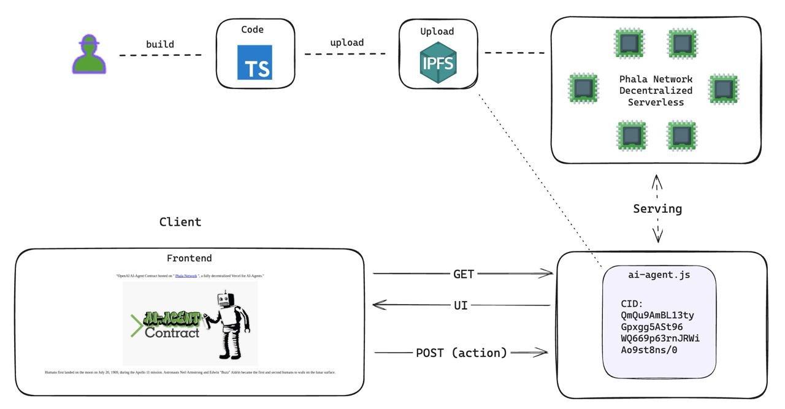

<div align="center">
  <a href="https://github.com/Phala-Network/ai-agent-template-brian">
    <h1>AI Agent Contract Template with Brian</h1>
    
    <br />
  </a>
  <p align="center">
    Host your AI Agent Contract on Phala's decentralized serverless cloud.
    <br />
    <a href="https://github.com/Phala-Network/ai-agent-template-brian"><strong>Explore the docs »</strong></a>
    <br />
    <br />
    <a href="https://wapo-testnet.phala.network/ipfs/QmSwPTx5jTCQ1TMaSphk5a8wRxceHF3kw4yHQzXDhGxRW4?key=22e8955d1a347f8f&chatQuery=What%20is%20MEV">View Demo</a>
    ·
    <a href="https://github.com/Phala-Network/ai-agent-template-brian/issues">Report Bug</a>
    ·
    <a href="https://discord.gg/phala-network">Discord</a>
  </p>

  <h3>Architecure Overview</h3>
  
</div>

## 🤖 What Is This?!

<div align="center">
  
</div>

The Brian AI Agent template is a **MINIMAL** template to build an AI Agent that can be hosted on Phala Network's decentralized hosting protocol. Unlike Vercel or other FaaS, it allows you to publish your AI Agent compiled code to IPFS and hosts it on a fully decentralized FaaS cloud with the following benefits:

- 💨 Ship Fast: Build and ship with familiar toolchain in minutes
- ⛑️ Secure: Execution guarded by rock solid TEE / Intel SGX
- 🔒 Private: Host API keys and user privacy at ease
- 💎 Unstoppable: Powered by IPFS and Phala's 35k+ decentralized TEE workers

[//]: # ()

## Getting Started
### Prepare
Install dependencies
```shell
npm install
```

### Testing Locally
Create `.env` file with the default ThirdWeb API key for publishing your Agent Contract to IPFS
```shell
cp .env.example .env
```

Build your Agent
```shell
npm run build
```

Test your Agent locally. Make sure to get a Brian API key and check the Brian API docs here https://docs.brianknows.org/brian-api-beta/apis/agent-apis
```shell
npm run test
```

Expected Test Results
```shell
INPUT: {"method":"GET","path":"/ipfs/CID","queries":{"chatQuery":["What is Uniswap?"]},"secret":{"brianApiKey":"BRIAN_API_KEY"},"headers":{}}
GET RESULT: {
  status: 200,
  body: `{"input":"What is Uniswap?","answer":"Uniswap is a decentralized finance (DeFi) protocol that enables users to swap various cryptocurrencies on the Ethereum blockchain without the need for an intermediary. It operates using an automated market-making (AMM) model, which differs from traditional order book exchanges. Here’s a comprehensive overview broken down into key sections:\\n\\n \\n\\n**1. Core Functionality:**\\n\\nUniswap allows users to trade Ethereum-based tokens (ERC-20 tokens) seamlessly. The protocol employs liquidity pools where users provide tokens to facilitate swaps. In return, liquidity providers earn fees proportional to their contribution to the pool. The protocol is designed to function autonomously, with smart contracts managing trades and liquidity.\\n\\n \\n\\n**2. Automated Market Maker (AMM):**\\n\\nUnlike traditional exchanges that depend on buy and sell orders, Uniswap employs an AMM model. This model utilizes a mathematical formula (x * y = k) to determine prices, where x and y are quantities of tokens in the pool, and k is a constant. This design ensures that the price of tokens adjusts automatically based on supply and demand, incentivizing liquidity providers while allowing users to engage in seamless swaps.\\n\\n \\n\\n**3. Liquidity Pools:**\\n\\nLiquidity pools are essential components of Uniswap. Users can create or join pools by supplying an equal value of two different tokens. This supply grants users liquidity provider (LP) tokens, representing their share of the pool. LPs earn transaction fees generated from swaps, which accumulate over time. Additionally, LPs risk impermanent loss—fluctuations in token prices relative to each other—which should be considered when providing liquidity.\\n\\n \\n\\n**4. Governance:**\\n\\nUniswap operates under a decentralized governance model, allowing its community of token holders to participate in decision-making. Through the governance token (UNI), users can vote on proposals that affect the protocol, including changes to fee structures, new pools, or upgrades to the underlying smart contracts.\\n\\n \\n\\n**5. Versions:**\\n\\nUniswap has undergone several iterations, with Uniswap V2 and V3 being the most notable. \\n\\n- **Uniswap V2** introduced features like flash swaps, which enable users to borrow assets without collateral, provided they return the borrowed amount within a single transaction.\\n\\n- **Uniswap V3** further refined the AMM approach by enabling concentrated liquidity. This allows LPs to allocate their liquidity within specific price ranges, enhancing capital efficiency and potentially yielding higher fees. V3 also introduced mechanisms for customizable fees per pool.\\n\\n \\n\\n**6. Ecosystem and Integrations:**\\n\\nUniswap is a pivotal part of the DeFi ecosystem and integrates with various decentralized applications (dApps) and wallets. Its widespread use facilitates composability, where other DeFi projects can use Uniswap's liquidity for their protocols. Moreover, users can access Uniswap through multiple interfaces, including wallets like MetaMask and web-based aggregators.\\n\\n \\n\\nFor further information on Uniswap, you can refer to their official documentation:\\n- [The Uniswap Protocol](https://uniswap.org/docs/v2/protocol-overview/)\\n- [Swaps](https://uniswap.org/docs/v2/core-concepts/swaps/)\\n- [Glossary](https://uniswap.org/docs/v2/guides/glossary/)\\n\\n"}`,
  headers: {
    'Content-Type': 'application/json',
    'Access-Control-Allow-Origin': '*'
  }
}
Now you are ready to publish your agent, add secrets, and interact with your agent in the following steps:
- Execute: 'npm run publish-agent'
- Set secrets: 'npm run set-secrets'
- Go to the url produced by setting the secrets (e.g. https://wapo-testnet.phala.network/ipfs/QmPQJD5zv3cYDRM25uGAVjLvXGNyQf9Vonz7rqkQB52Jae?key=b092532592cbd0cf)
```

### Publish Your AI Agent
Upload your compiled AI Agent code to IPFS.
```shell
npm run publish-agent
```

Upon a successful upload, the command should show the URL to access your AI Agent.
```shell
✓ Compiled successfully.
  1.4 KB  dist/index.js
Running command: npx thirdweb upload dist/index.js
This may require you to log into thirdweb and will take some time to publish to IPFS...

    $$\     $$\       $$\                 $$\                         $$\       
    $$ |    $$ |      \__|                $$ |                        $$ |      
  $$$$$$\   $$$$$$$\  $$\  $$$$$$\   $$$$$$$ |$$\  $$\  $$\  $$$$$$\  $$$$$$$\  
  \_$$  _|  $$  __$$\ $$ |$$  __$$\ $$  __$$ |$$ | $$ | $$ |$$  __$$\ $$  __$$\ 
    $$ |    $$ |  $$ |$$ |$$ |  \__|$$ /  $$ |$$ | $$ | $$ |$$$$$$$$ |$$ |  $$ |
    $$ |$$\ $$ |  $$ |$$ |$$ |      $$ |  $$ |$$ | $$ | $$ |$$   ____|$$ |  $$ |
    \$$$$  |$$ |  $$ |$$ |$$ |      \$$$$$$$ |\$$$$$\$$$$  |\$$$$$$$\ $$$$$$$  |
     \____/ \__|  \__|\__|\__|       \_______| \_____\____/  \_______|\_______/ 

 💎 thirdweb v0.14.12 💎

- Checking for updates...

- Uploading file to IPFS. This may take a while depending on file sizes.

✔ Successfully uploaded file to IPFS.
✔ Files stored at the following IPFS URI: ipfs://QmSwPTx5jTCQ1TMaSphk5a8wRxceHF3kw4yHQzXDhGxRW4
✔ Open this link to view your upload: https://b805a9b72767504353244e0422c2b5f9.ipfscdn.io/ipfs/bafybeicektlospxpfnmytvnbpxtulsvhpszi3yipgwgvmo4vv47brqokpu/

Agent Contract deployed at: https://wapo-testnet.phala.network/ipfs/QmSwPTx5jTCQ1TMaSphk5a8wRxceHF3kw4yHQzXDhGxRW4

If your agent requires secrets, ensure to do the following:
1) Edit the ./secrets/default.json file or create a new JSON file in the ./secrets folder and add your secrets to it.
2) Run command: 'npm run set-secrets' or 'npm run set-secrets [path-to-json-file]'
Logs folder created.
Deployment information updated in ./logs/latestDeployment.json
```

> :information_source: Note that your latest deployment information will be logged to in file [`./logs/latestDeployment.json`](./logs/latestDeployment.json). This file is updated every time you publish a new Agent Contract to IPFS. This file is also used to get the IPFS CID of your Agent Contract when setting secrets for your Agent Contract.
>
> Here is an example:
> ```json
> {
>   "date": "2024-08-29T20:28:20.081Z",
>   "cid": "QmYzBTdQNPewdhD9GdBJ9TdV7LVhrh9YVRiV8aBup7qZGu",
>   "url": "https://wapo-testnet.phala.network/ipfs/QmYzBTdQNPewdhD9GdBJ9TdV7LVhrh9YVRiV8aBup7qZGu"
> }
> ```

<details>
<summary>New to Thirdweb?</summary>
We use <a href="https://thirdweb.com/dashboard/infrastructure/storage">thirdweb Storage</a> to host IPFS contents. If you are new to thirdweb, the command will guide you to create your account or login to your existing account from the browser.
</details>

> **Did Thirdweb fail to publish?**
>
> If ThirdWeb fails to publish, please signup for your own ThirdWeb account to publish your Agent Contract to IPFS. Signup or login at https://thirdweb.com/dashboard/
>
> Whenever you log into ThirdWeb, create a new API key and replace the default API Key with yours in the [.env](./.env) file.
>
> ```
> THIRDWEB_API_KEY="YOUR_THIRDWEB_API_KEY"
> ```

### Access the Published AI Agent

Once published, your AI Agent is available at the URL: `https://wapo-testnet.phala.network/ipfs/<your-cid>`. You can get it from the "Publish to IPFS" step.

You can test it with `curl`.

```bash
curl https://wapo-testnet.phala.network/ipfs/<your-cid>
```

### Add Secrets

By default, all the compiled JS code is visible for anyone to view if they look at IPFS CID. This makes private info like API keys, signer keys, etc. vulnerable to be stolen. To protect devs from leaking keys, we have added a field called `secret` in the `Request` object. It allows you to store secrets in a vault for your AI Agent to access.

To add your secrets, make sure to get a Brian API key and check the Brian API docs here https://docs.brianknows.org/brian-api-beta/apis/agent-apis
1) Edit the [default.json](./secrets/default.json) file or create a new JSON file in the `./secrets` folder and add your secrets to it.
```json
{
  "brianApiKey": "YOUR_BRIAN_API_KEY"
}
```
2) Run command to set the secrets
```shell
npm run set-secrets
# or if you have a custom JSON file
npm run set-secrets <path-to-json-file>
```

Expected output:
```shell
Storing secrets...
  % Total    % Received % Xferd  Average Speed   Time    Time     Time  Current
                                 Dload  Upload   Total   Spent    Left  Speed
100   176    0    68  100   108     71    113 --:--:-- --:--:-- --:--:--   184
{"token":"9fb0e1dd48c71ba1","key":"22e8955d1a347f8f","succeed":true}

Secrets set successfully. Go to the URL below to interact with your agent:
https://wapo-testnet.phala.network/ipfs/QmSwPTx5jTCQ1TMaSphk5a8wRxceHF3kw4yHQzXDhGxRW4?key=22e8955d1a347f8f
Log entry added to secrets.log
```

> :information_source: Note that all your secrets will be logged in file [`./logs/secrets.log`](./logs/secrets.log). This file is updated every time you add new secrets to your Agent Contract. If you have not published an Agent Contract, yet, this command will fail since there is not a CID to map the secrets to.
>
> Here is an example:
> ```text
> 2024-08-29T20:30:35.480Z, CID: [QmYzBTdQNPewdhD9GdBJ9TdV7LVhrh9YVRiV8aBup7qZGu], Token: [37a0f3f344a3bbf7], Key: [343e2a7dc130fedf], URL: [https://wapo-testnet.phala.network/ipfs/QmYzBTdQNPewdhD9GdBJ9TdV7LVhrh9YVRiV8aBup7qZGu?key=343e2a7dc130fedf]
> ```

The API returns a `token` and a `key`. The `key` is the id of your secret. It can be used to specify which secret you are going to pass to your frame. The `token` can be used by the developer to access the raw secret. You should never leak the `token`.

To verify the secret, run the following command where `key` and `token` are replaced with the values from adding your `secret` to the vault.
```shell
curl https://wapo-testnet.phala.network/vaults/<key>/<token>
```

Expected output:
```shell
{"data":{"brianApiKey":"<BRIAN_API_KEY>"},"succeed":true}
```

### Access Queries
To help create custom logic, we have an array variable named `queries` that can be accessed in the `Request` class. To access the `queries` array variable `chatQuery` value at index `0`, the syntax will look as follows:
```typescript
const query = req.queries.chatQuery[0] as string;
```
The example at https://wapo-testnet.phala.network/ipfs/QmSwPTx5jTCQ1TMaSphk5a8wRxceHF3kw4yHQzXDhGxRW4?key=22e8955d1a347f8f&chatQuery=What%20is%20MEV will have a value of `What is MEV?`. `queries` can have any field name, so `chatQuery` is just an example of a field name and not a mandatory name, but remember to update your `index.ts` file logic to use your expected field name.

## FAQ

<details>
<summary><b>What packages can I use in the AI Agent server?</b></summary>
<ul>
  <li>Most of the npm packages are supported: viem, onchainkit, ….</li>
  <li>Some packages with some advanced features are not supported:</li>
  <ul>
    <li>Memory usage over 100MB</li>
    <li>Web Assembly</li>
    <li>Browser only features: local storage, service workers, etc</li>
  </ul>
</ul>
</details>

<details>
<summary><b>What’s the spec of the Javascript runtime?</b></summary>
<ul>
  <li>The code runs inside a tailored <a href="https://bellard.org/quickjs/">QuickJS engine</a></li>
  <li>Available features: ES2023, async, fetch, setTimeout, setInterval, bigint</li>
  <li> <a href="https://docs.phala.network/tech-specs/ai-agent-contract#wapojs/">Tech spec doc</a></li>
</ul>
</details>

<details>
<summary><b>Why is the serverless platform secure?</b></summary>
<ul>
  <li>Your AI Agent code on is fully secure, private, and permissionless. Nobody can manipulate your program, steal any data from it, or censor it.</li>
  <li>Security: The code is executed in the decentralized TEE network running on Phala Network. It runs code inside a secure blackbox (called enclave) created by the CPU. It generates cryptographic proofs verifiable on Phala blockchain. It proves that the hosted code is exactly the one you deployed.</li>
  <li>Privacy: You can safely put secrets like API keys or user privacy on Phala Network. The code runs inside TEE hardware blackboxs. The memory of the program is fully encrypted by the TEE. It blocks any unauthorized access to your data.</li>
  <li>Learn more at <a href="https://phala.network">Phala Network Homepage</a></li>
</details>

<details>
<summary><b>What's TEE / Intel SGX?</b></summary>
<ul>
  <li><a href="https://collective.flashbots.net/t/tee-sgx-wiki/2019">TEE/SGX wiki</a></li>
  <li><a href="https://collective.flashbots.net/t/debunking-tee-fud-a-brief-defense-of-the-use-of-tees-in-crypto/2931">Debunking TEE FUD: A Brief Defense of The Use of TEEs in Crypto</a></li>
</details>
